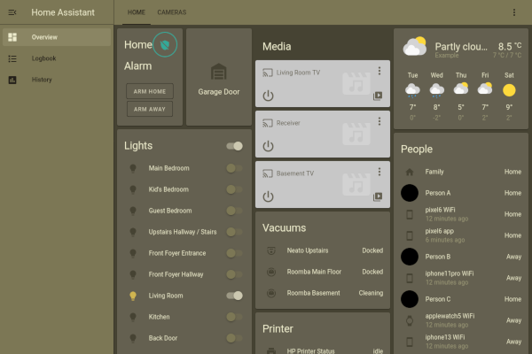
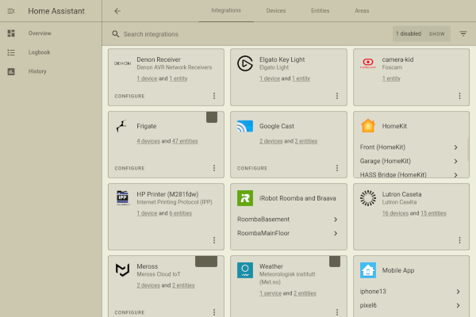

# Home Assistant IBM1970 Theme

An IBM and 1970s inspired dark and light color theme for
[Home Assistant](https://www.home-assistant.io/).

This color theme is part of the
[IBM1970 desktop theme](https://github.com/andornaut/ibm1970-desktop-theme).

## Installation

Copy [`./themes/ibm1970.yaml`](./themes/ibm1970.yaml) to `${HomeAssistant}/config/themes/`.

See
[ansible-role-homeassistant-frigate](https://github.com/andornaut/ansible-role-homeassistant-frigate)
for an example of the installation procedure.
